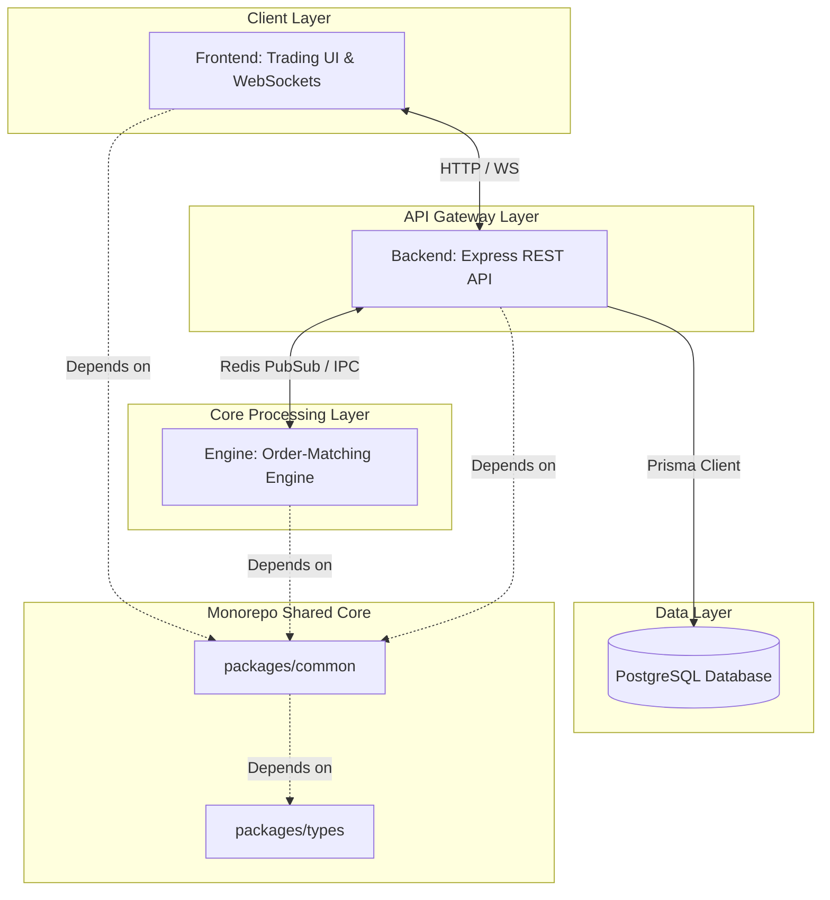

# Centralized Exchange (CEX)

A production-grade, high-performance Centralized Exchange (CEX) platform structured as a TypeScript/pnpm monorepo. This system is designed for high throughput, low-latency order matching, and clean segregation of concerns across micro-services.

---

## Current Project Status

We are currently in the **foundation phase**. The directory structure, workspace configuration, and initial backend shell are ready. No core business logic, matching engine routines, database tables, or front-end components are implemented yet.

*   [x] Workspace structures defined (`apps/*`, `packages/*`, `docker/`, `docs/`)
*   [x] pnpm workspace linked
*   [x] TypeScript compile environment configured
*   [x] `apps/backend` Express bootstrap with Helmet, CORS, Compression, and Pino structured logging
*   [x] Prisma ORM integration ready for PostgreSQL
*   [x] JWT Authentication & Protected Profile endpoints (`/auth/register`, `/auth/login`, `/auth/me`)
*   [x] Asset & Market Management APIs (`/assets`, `/markets`)
*   [x] User Balance Management System & Simulated Ledger Deposits (`/balances`)
*   [x] Order Placement, Cancellation & Balance Locking/Releasing (`/orders`)
*   [x] Shared math, database clients, and helpers (`packages/common`)
*   [x] Shared interface and type definitions (`packages/types`)
*   [x] High-performance Matching Engine (`apps/engine`)
*   [ ] Database migrations, schemas, and indexing
*   [x] Frontend Trading Dashboard and WebSockets (`apps/frontend`)

---

## Tech Stack

*   **Runtime Environment**: Node.js (>=18.0.0)
*   **Package Management**: `pnpm` (>=9.0.0) Workspace Monorepo
*   **Language**: TypeScript (v5.5+)
*   **Web Framework (Backend)**: Express
*   **Database ORM**: Prisma (PostgreSQL connector)
*   **Bundler/Execution**: `tsx` (TypeScript Execute) & `tsc`

---

## Project Structure

The codebase is organized as follows:

```text
├── apps/
│   ├── backend/        # API Gateway (REST & WebSockets)
│   ├── engine/         # Order matching & execution engine
│   └── frontend/       # User dashboard, charts, & trading interface
├── packages/
│   ├── common/         # Shared utilities (math, DB clients, logs)
│   └── types/          # Shared type and interface declarations
├── docs/               # Architecture diagrams, specifications, & runbooks
└── docker/             # Docker Compose setups & container definitions
```

---

## Architecture Flow

The high-level architecture separates the public-facing API Gateway (Backend) from the stateful matching engine (Engine) to guarantee sub-millisecond execution order processing.



---

## Setup Instructions

### Prerequisites
*   Node.js (>= 18)
*   pnpm (>= 9)
*   PostgreSQL Database instance

### 1. Installation
Clone the repository and install workspace dependencies:
```bash
pnpm install
```

### 2. Configure Environment Variables
Navigate to `apps/backend/` and configure your environment:
```bash
cp apps/backend/.env
```
Inside `apps/backend/.env`, set:
*   `PORT`: Port for the API server (default `3000`)
*   `NODE_ENV`: Application environment (`development`, `production`, `test`)
*   `DATABASE_URL`: PostgreSQL connection string
*   `JWT_SECRET`: Secret key for signing JSON Web Tokens
*   `REDIS_URL`: Redis server connection URL (e.g., `redis://localhost:6379`)

### 3. Build & Run
To run the backend server in development mode:
```bash
pnpm --filter @cex/backend dev
```

To compile the entire workspace:
```bash
pnpm build
```

---

## Roadmap

### Phase 1: Core Foundation & API
*   [x] Set up workspace and monorepo configurations.
*   [x] Set up basic Express HTTP backend.
*   [x] Configure Prisma with PostgreSQL database layer.
*   [x] Implement Authentication system (JWT)
*   [x] Model the DB schema (Users, Assets, Balances, Markets, Orders, Fills, Transactions)
*   [x] Implement Asset & Market Management APIs
*   [x] Implement User Balance Ledger and Deposits
*   [x] Implement Order Placement, Cancellation and Balance Releasing

### Phase 2: High-Performance Matching Engine
*   [x] Implement a stateful, memory-based limit order book (LOB) with FIFO price-time priority.
*   [x] Integrate Redis List Queue (LPUSH/BRPOP) to queue order requests from the API.
*   [x] Implement double-entry ledger bookkeeping for trade settlements.

### Phase 3: Real-Time & WebSockets
*   [ ] Set up Socket.io/WS feeds in the backend.
*   [ ] Establish market-data feeds (ticker, order book updates, recent trades).
*   [ ] Implement user-specific trade execution and balance alerts.

### Phase 4: Frontend Development
*   [x] Scaffold React + TypeScript + Vite + Tailwind CSS frontend architecture.
*   [x] Create core pages (Landing, Login, Register, Trade Dashboard grid, Portfolio Wallet).
*   [x] Connect the React frontend to the Express backend API (Auth & Wallet).
*   [x] Implement real-time WebSocket client sync for Order Book depth and Recent Trades.
*   [x] Wire Order Entry panel to POST /orders API with toast feedback and loading states.
*   [x] Integrate lightweight-charts candlestick chart and Open Orders management panel.

### Phase 5: Infrastructure & DevOps
*   [x] Dockerize all services with multi-stage builds (backend, engine, frontend).
*   [x] Docker Compose orchestration with postgres, redis, engine, backend, frontend.
*   [x] Health checks, named volumes, and internal Docker networking.
*   [ ] CI/CD pipeline (GitHub Actions).
*   [ ] Cloud deployment (Railway / Render / AWS).

---

## 🐳 Running with Docker

### Prerequisites
- Docker ≥ 24 and Docker Compose v2

### Quick Start
```bash
# 1. Copy environment file and adjust secrets
cp .env.example .env

# 2. Build images and start all services (detached)
pnpm docker:up

# 3. Run Prisma migrations inside the backend container
docker exec cex_backend npx prisma migrate deploy

# 4. (Optional) Seed the database
docker exec cex_backend node dist/scripts/seed.js

# 5. Open the app
#    Frontend → http://localhost
#    Backend API → http://localhost:3000/api/v1
```

### Useful Commands
| Command | Description |
|---|---|
| `pnpm docker:up` | Build & start all containers (detached) |
| `pnpm docker:down` | Stop containers (data preserved) |
| `pnpm docker:logs` | Tail logs for all services |
| `pnpm docker:ps` | Show running containers + ports |
| `pnpm docker:clean` | Destroy containers, volumes & local images |


## Future Features

*   **Internal Ledger Audits**: Real-time solvency and cryptographic Proof of Reserves (PoR).
*   **Security Mechanisms**: Multi-signature deposit systems and cold/warm/hot wallet management structures.
*   **API Keys Management**: Cryptographically signed HMAC header authentication for algorithmic traders.

---

## Contributing

1. Create a feature branch: `git checkout -b feature/your-feature-name`
2. Commit your changes: `git commit -m 'feat: add some feature'`
3. Push to the branch: `git push origin feature/your-feature-name`
4. Open a Pull Request.

---

## License

This project is licensed under the MIT License - see the `LICENSE` file for details.
